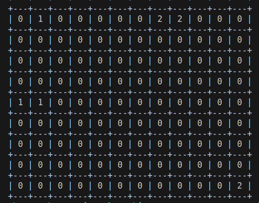

# CS4300 AI FinalProject - Acquire Board Game

### About Acquire

* (1968 Edition)—an
investing board game with money, stocks, and hotel
chains.

* Game is represented on a 9x12 grid and this
project focuses on a simplified tile placing
aspect.

### PEAS Assessment

* Performance Measure
    * Calculated on how big each hotel chain is multiplied by the rank of the hotel chain.
* Environment
    * Originally Partially Observable, but changed to observable
    * Deterministic
    * Sequential
    * Static
    * Multi-Agent
    * Known
    
* Actions (Actuators)
    * Create a new hotel
    * Add to an existing hotel
    * Add a stand-alone tile to board
* Percepts (Sensors)
    * The hands of all agents
    * The Board State
    * Current Agent
    * Available Tiles to be drawn (shuffled once on reset)

### The Agent(s)
* Mini-Max Search
* Evaluation based on more advantageous tile position available
* Two agents (1 & 2 on board)

### Agents' Performance
* Estimated Performance
    * Agent is able to determine which move is best out of the hand it is dealt and other percepts
* Actual Performance
    * Doesn't fully work as intended and still needs tweaking of evaluation function

### Final Result
* Made Custom Petting Zoo Environment
* Multi-Agent

### Future Improvements and Changes to Current Project
* Spend more time adjusting the mini-max evaluation function
* Test other search algorithms and do more comparison
* Add merging of hotels
* Add in other aspects of the game like money, purchasing stocks, and trading/selling/saving stocks with a merge

